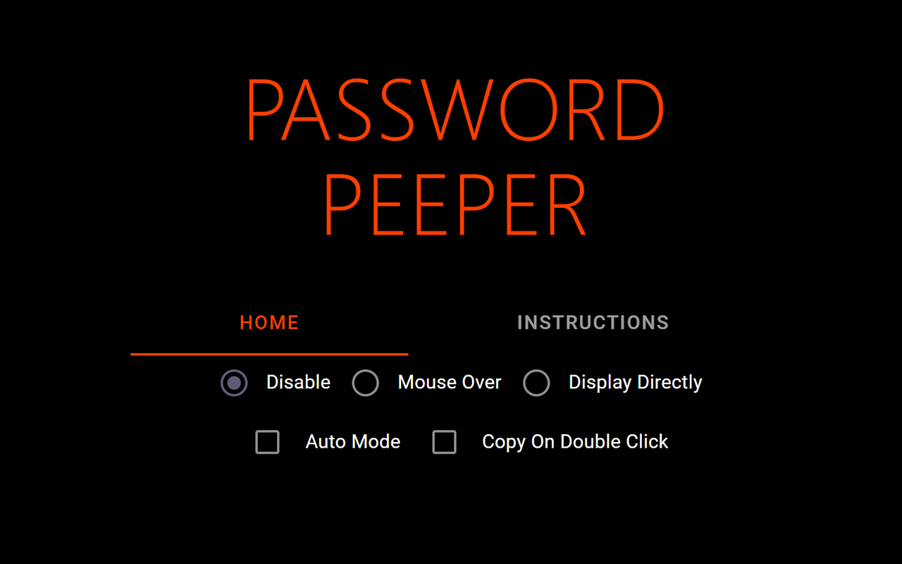

# Password Peeper



## Introduction

Password Peeper is a simple chrome extension that enables users to have a peep of their forgotten passwords or copy the passwords to clipboard without any effort.

I let browser remember some of my passwords so that it can auto-fill my password during authentication. When I forget my password, I also try to find it in the browser.

I had 2 options

1. Go the **Settings** -> **Passwords** and search for the website domain.
2. Use developer tool to locate the password input DOM element, copy its JS path, paste the path into console and append `.value` to the JS path to read the password.

These 2 methods works but is too time consuming.

That's why I decieded to make this **Password Peeper** chrome extension to make the process seamless. One can simply hover over the password to view its value, show all passwords on a website automatically, or with a keyboard shortcut.

## Bookmark Method

Another much simpler solution is bookmark. In Chrome, bookmarks can run JavaScript.

Add the following code to an empty bookmark's url.

```js
javascript: document.querySelectorAll("input[type='password']").forEach((ele) => {
  ele.setAttribute('type', 'text');
});
```

By clicking on the bookmark, all passwords on a page will be displayed in text. It's already super easy to use.

The extension **Password Peeper** provides more features, such as,

1. Auto show passwords when page is loaded
2. Copy to clipboard on double click
3. Show password on hover (manually trigger or automatically trigger)

## Development

The UI is written with Svelte and Svelte Material UI and TypeScript.

The content and background scripts are located in `dist` as JavaScript files. TypeScript is not used for them simply because I am lazy and this extension is quite simple.

- `npm i` to install the dependencies.
- `npm run dev` to run development server,
- `npm run build` to build the UI into `dist/ui`.
- `npm run prepare` when a new `@smui` package is installed to update the theme files.
